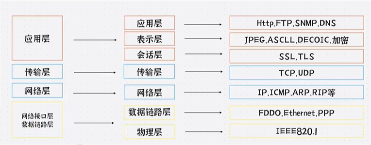

# TCP/IP

## OSI七层模型
七层模型，亦称OSI（Open System Interconnection）。参考模型是国际标准化组织（ISO）制定的一个用于计算机或通信系统间互联的标准体系，一般称为OSI参考模型或七层模型，也有很多人把它分为四层还有五层。
它是一个七层的、抽象的模型体，不仅包括一系列抽象的术语或概念，也包括具体的协议。

信道
- 明线
- 对称电缆
- 同轴电缆
- 光纤

无线信道
- 无线电波
## TCP三次握手

## TCP四次挥手