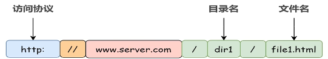

# 浏览器输入URL发生了什么

## 什么是URL
一个URL由三部分组成：

## DNS查询
IP和域名映射
查询顺序
- 浏览器自身DNS
- 操作系统DNS
- 本地hosts文件
- 域名服务器

## 三次握手

## 强缓存
让浏览器缓存一些静态资源：图片、css、js、gs
后台往请求头中写入Cache-Control:max-age=10、Expires:GMT时间
disk cache硬盘缓存、memory cache 内存缓存
## 协商缓存

## 四次挥手

## 开始渲染

## 回流与重绘
会导致回流与重绘的操作

## V8引擎解析JavaScript

